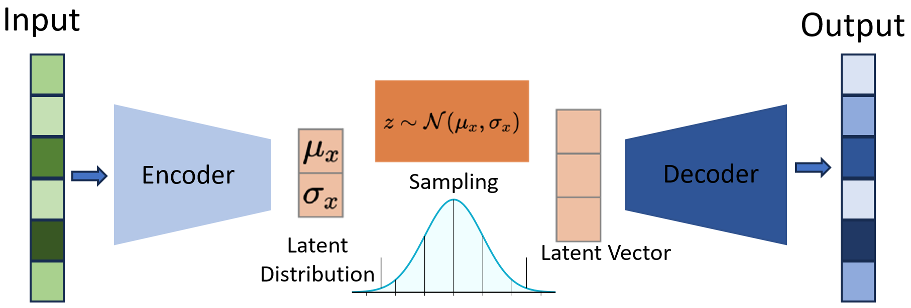

## Inversion of GPR B-scans Using Deep Neural Networks
A generative model is used to learn a joint distribution of GPR B-scans and corresponding structural geometry for inversion. The dataset describes buried objects with reflective properties at different positions in a soil-like medium.

    
    
<strong>Figure 1:</strong> (Top) Cylinders of various diameters buried in concrete at different locations, (Bottom) Corresponding GPR scans obtained by numerical simulation.

An Autoencoder (AE) is a generative model that uses converging neural networks (NNs) to encode high dimensional input data to a lower dimensional space. A decoder, consisting of diverging NNs subsequently samples from the embedded space and learns to re-create a high dimensional output. A Variational Autoencoder (VAE) is a modified AE where the encoded representations are normal distributions instead of distinct points. This enables VAEs to output predictions that are more consistent and continuously varied. 

    
    
<strong>Figure 1:</strong> Results of AE inversion of GPR B-scans from buried cylinders. The material interfaces are blurry for the cylinders. However, the location and size of the object are detected with accuracy except for sample (d).

In this problem, the synthetic scans are fed as input to the VAE's encoder. The decoder outputs the underlying geometry. Thus, the VAE essentially learns to perform full inversion on the GPR B-scan data. Mean square error is used as loss function, although a more educated loss function, such as SSIM can be explored in the future for a performance boost. 

    
    
<strong>Figure 1:</strong> Top)An Autoencoder model is trained, using simulated B-scans as input and the permittivity map of the predicted structure as output. Mean squared error is used to compute the difference between the predicted structure and the actual structure as the loss function. 

As seen in Figure 4, the simple VAE architecture can identify the location of the rebar and estimate their diameters to a reasonable degree of accuracy. Poor inversion result is observed for sample case (d), possibly due to its smaller diameter. The small object size leads to a smaller signal perturbation, whose information is possibly lost during the aggressive down-sampling in the encoder.

    
    
<strong>Figure 1:</strong> Results of AE inversion of GPR B-scans from buried cylinders. The material interfaces are blurry for the cylinders. However, the location and size of the object are detected with accuracy except for sample (d).

