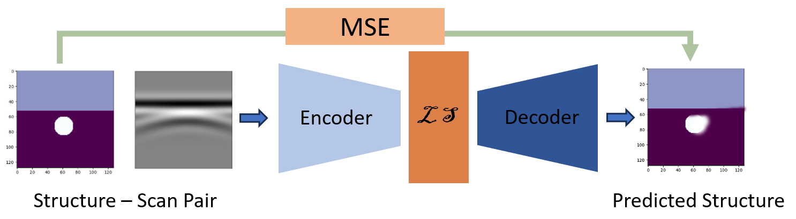

## Inversion of GPR B-scans Using Deep Neural Networks
A generative model is used to learn a joint distribution of GPR B-scans and corresponding structural geometry for inversion. The dataset describes buried objects with reflective properties at different positions in a soil-like medium.

    
    
<strong>Figure 1:</strong> Results of AE inversion of GPR B-scans from buried cylinders. The material interfaces are blurry for the cylinders. However, the location and size of the object are detected with accuracy except for sample (d).

    
    
<strong>Figure 1:</strong> (Top) Cylinders of various diameters buried in concrete at different locations, (Bottom) Corresponding GPR scans obtained by numerical simulation.

    
    
<strong>Figure 1:</strong> Top)An Autoencoder model is trained, using simulated B-scans as input and the permittivity map of the predicted structure as output. Mean squared error is used to compute the difference between the predicted structure and the actual structure as the loss function. 

    
    
<strong>Figure 1:</strong> Results of AE inversion of GPR B-scans from buried cylinders. The material interfaces are blurry for the cylinders. However, the location and size of the object are detected with accuracy except for sample (d).

    
    
<strong>Figure 2:</strong> Both material type and subwavelength sample thickness values were correctly predicted by the proposed model.

    
    
<strong>Figure 2:</strong> Both material type and subwavelength sample thickness values were correctly predicted by the proposed model.

    
    
<strong>Figure 2:</strong> Both material type and subwavelength sample thickness values were correctly predicted by the proposed model.

