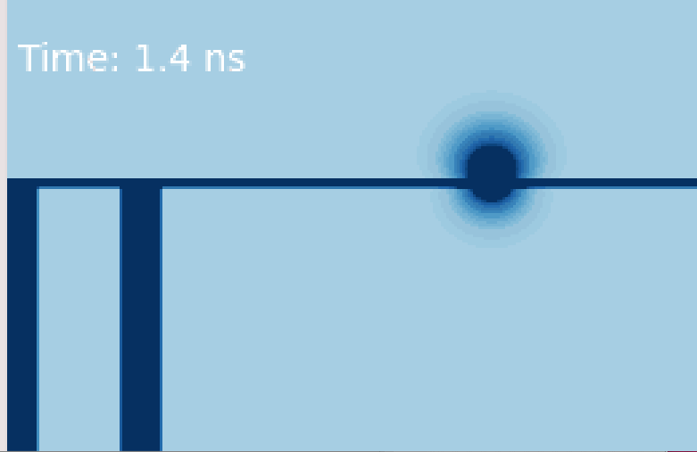
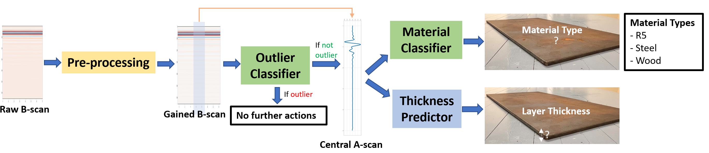
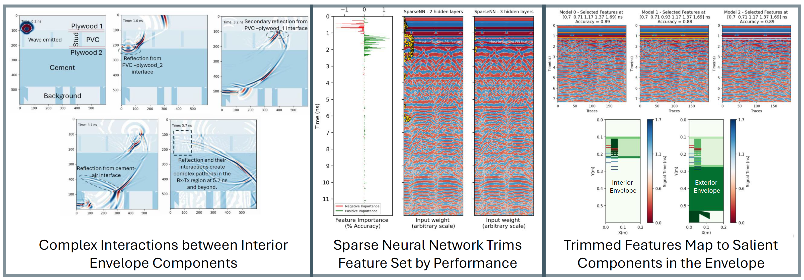
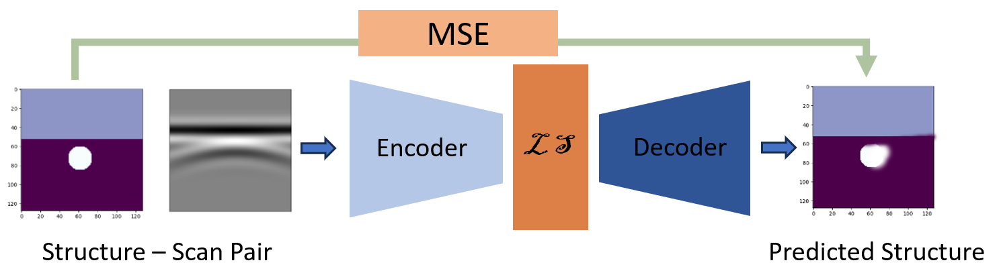
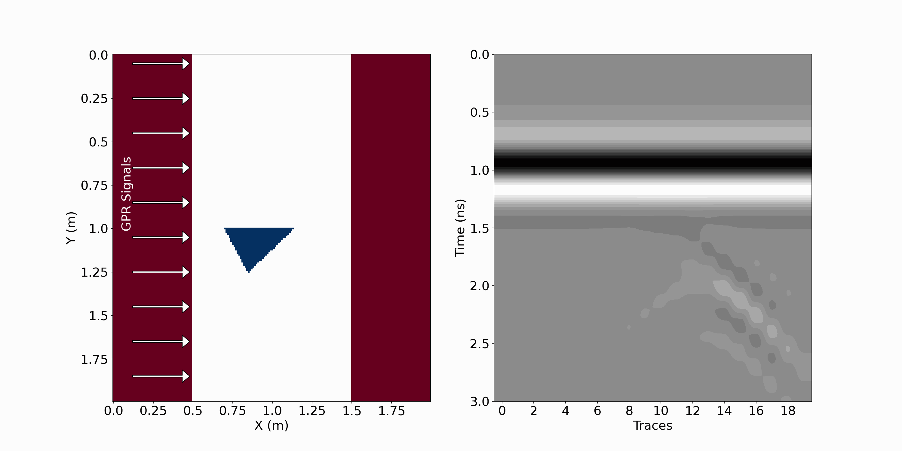

# Ahmed Nirjhar Alam's Portfolio

    

## Bio

I am a 5th year PhD student at Pennsylvania State University's Material Science Department. I employ data and physics-driven techniques to decipher critical information from radar scattering data. This portfolio contains glimpses of my published work and  projects that are either in progress or were not substantial enough for separate publication, yet interesting. 

## Publications
- **Data-driven evaluation of building materials using Ground Penetrating Radar**  
  A data-driven approach for predicting material type and layer thickness from GPR scans is proposed. The methodology also successfully detects sub-wavelength thicknesses. [Read more](https://www.sciencedirect.com/science/article/pii/S235271022401756X).

    
    
<strong>Figure 1:</strong> Supposedly indiscernible reflections from interfaces with subwavelength separation are accurately predicted using data-driven methods.

    
    
<strong>Figure 2:</strong> Both material type and subwavelength sample thickness values were correctly predicted by the proposed model.

- **Interpretable AI for Building Envelope Inversion (*submitted*)**  
  Building envelopes represent a challenge for GPR, due to their lower permittivity contrasts and comparatively cluttered interiors. This work proposes a data-driven framework, utilizing sparse neural networks, for diagnosing building envelopes using GPR signals. The proposed framework is accurate, highly interpretable, and robust to spurious patterns in the signal.

    
    
<strong>Figure 3:</strong> (left) Complex reflections within building envelope interior, (center) Sparse neural network interprets signals while trimming low-quality features, (right) Selected features  map to salient locations
        in the building envelope.

## Conferences
- **ASCE Engineering Mechanics Institute 2022 Conference**  
  Brief description of the presentation. [Abstract (see page 8)](https://www.emi-conference.org/sites/emi-conference.org/2022/files/inline-files/EMI%202022%20Book%20of%20Abstracts.pdf).

- **ASCE Engineering Mechanics Institute 2023 Conference**  
  Brief description of the presentation. [Abstract (see page 30)](https://www.asce.org/-/media/798f777f1bb446ceb8a290267b11cb79.ashx).

- **ASCE Engineering Mechanics Institute 2024 Conference**  
  Brief description of the presentation. [Abstract (see page 8)](https://www.asce.org/-/media/798f777f1bb446ceb8a290267b11cb79.ashx)

## Works in Progress
- **GPR Scan Inversion Using Deep Neural Network**  
  A generative model inverts GPR B-scans for a buried object problem. A relatively light VAE model accurately indicates the objects' position and size, although results are inconclusive when the buried object is small.
  
  

    
    
<strong>Figure 4:</strong> A Variational Autoencoder (VAE) models the joint distribution between input geometries - represented as permittivity maps of subsurface structures - and their corresponding B-scans. This enables computationally efficient full-waveform inversion of GPR data for target configurations. 

[See project details](./DNN-inversion/README.md).

- **Orientation Detection for Angular Defects in Building Envelopes**
This study investigates the potential of convolutional neural networks (CNNs) for detecting such defects. To this end, a controlled experiment is designed in which an isosceles triangular defect is rotated within a building envelope. For each orientation, the corresponding GPR B-scan of the wall section is simulated using an FDTD solver (GPRMax). A convolutional regression model is then employed to predict the angle of orientation of the defect from the resulting radargrams.

  

    
    
<strong>Figure 5:</strong> Although a continuous shift is observed with a change in orientation, this pattern breaks down when the sharp corners of the defect are oriented toward the incoming GPR signals. 

[See project details](https://nirjharalam.github.io/triangular_defect/).
